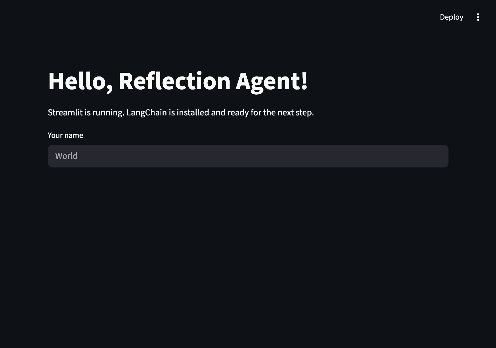
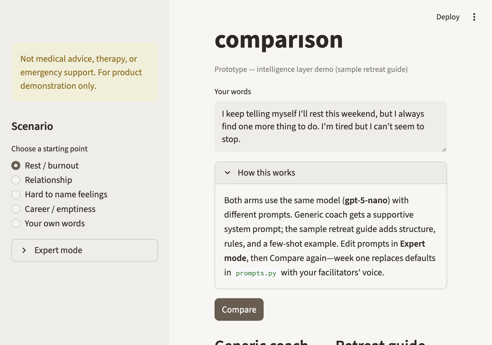

# Reflection Intelligence Layer Demo

---

## What is This?

This demo shows how the **intelligence layer**—system prompt, structure, and few-shot examples—not model choice, determines whether an AI reply feels like a generic wellness coach or a calm retreat guide.

It is built for founders and product leaders evaluating a "retreat in your pocket" product. The app runs one Streamlit compare screen: same model, same user words, two different prompt stacks side by side.

**Not production.** This is a ~3 minute narrative demo on a shared URL, labeled as a **sample retreat guide**.

---

## Screenshots

### Before (hello-world scaffold)



### Compare screen



### After Compare (Rest / burnout scenario)

Same model (`gpt-5-nano`), same input—different intelligence layer. Generic coach offers tips and encouragement; the sample retreat guide reflects back specific language and asks at most one deepening question.


---

## What Problems Does It Solve?

- **"Just pick a better model"** — The demo shows that voice and trust come from prompts and structure, not swapping models.
- **Black-box AI** — Expert mode and **View prompt used** expose exactly what ran on each Compare.
- **Generic wellness-bot tone** — The retreat guide arm is constrained to calm reflection, no tip lists, no cheerleading.
- **Slow iteration on facilitator voice** — Defaults live in `prompts.py`; week one replaces copy while the architecture stays the same.

---

## How Does the Demo Work?

The demo is a single Streamlit app with four main ideas:

1. **Scenario picker**
   - Choose Rest / burnout, Relationship, Hard to name feelings, Career / emptiness, or Your own words.
   - Canned scenarios prefill the text area; edits are preserved when you switch scenarios.

2. **Compare**
   - Click **Compare** to run two LangChain chains on the same input:
     - **Generic coach** — supportive, practical, tip-friendly.
     - **Retreat guide** — structured reflection + optional "Something to sit with" question.
   - Both arms use the same `gpt-5-nano` instance.

3. **Expert mode (sidebar)**
   - View and edit system prompts and the few-shot example.
   - **Reset prompts to defaults** restores `prompts.py` copy.
   - Changes are session-only until you Compare again.

4. **Transparency**
   - Under each column, **View prompt used** shows the prompt snapshot from that run.
   - **How this works** explains same-model / different-chain design.

---

## Why Should You Care?

- **Prove the product thesis in minutes:** Same words, visibly different experience.
- **Build trust with non-technical stakeholders:** Prompts are visible and editable live.
- **De-risk Phase 1:** Voice and methodology before fine-tuning, RAG, or multi-day memory.
- **Rehearse a tight narrative:** A scripted 3-minute walkthrough is included below.

---

## Demo script (~3 min)

1. **20 sec:** "Same model, same words—only the intelligence layer changes."
2. Scenario **Rest / burnout** → **Compare**.
3. Read one Generic sentence that sounds like a wellness bot.
4. Read Guide **Reflection**; point at echoed specificity; read **Something to sit with**.
5. **30 sec:** "Week one with your facilitators replaces this sample guide—the architecture stays the same."
6. Optional: **Hard to name feelings** scenario, Compare again.
7. Close: "Phase 1 of the roadmap—voice before fine-tuning or heavy memory."

---

## How to Try It

**Requirements:** Python 3.10+, [uv](https://docs.astral.sh/uv/), OpenAI API key.

1. Install dependencies:
   ```bash
   uv sync
   cp .env.example .env
   # Add OPENAI_API_KEY to .env
   ```
2. Run the app:
   ```bash
   uv run streamlit run app.py
   ```
3. Open http://localhost:8501

Optional: set `REFLECTION_MODEL=gpt-4o-mini` in `.env` if `gpt-5-nano` is unavailable in your account.

**Tests** (mocked LLM, no API spend):

```bash
uv run pytest tests/ -v
```

---

## Deploy (Streamlit Community Cloud)

1. Push this repo to GitHub.
2. [share.streamlit.io](https://share.streamlit.io) → **New app** → connect repo.
3. Main file path: `app.py`
4. Add secret `OPENAI_API_KEY` in app settings.
5. Open the shared URL ~2 minutes before a live call (cold start).

---

## Stack

| Tool | Purpose |
|------|---------|
| Streamlit | Compare UI, Expert mode, scenarios |
| LangChain + LangChain OpenAI | Generic and guide chains |
| Pydantic | Structured `GuideOutput` for the guide arm |
| OpenAI `gpt-5-nano` | Shared model for both arms (`reasoning_effort=minimal`) |
| uv | Dependency management |

---

## What's Next?

- Replace `prompts.py` defaults with facilitator interviews (week one voice)
- Quality lab: regression on canned scenarios before each release
- Three-day journey demo: session notes + Day 3 continuity (separate scope)
- Auth, persistence, RAG, and production guardrails (out of scope for this demo)

---

## Project structure

| Path | Role |
|------|------|
| `app.py` | Streamlit compare UI + Expert mode |
| `prompts.py` | `get_defaults()` — version-controlled prompt strings |
| `intelligence.py` | `run_generic`, `run_guide`, shared LLM |
| `scenarios.json` | Canned scenario prefills |
| `.streamlit/config.toml` | Warm neutral theme |
| `tests/` | Unit tests (mocked LLM) |
| `strategy_planning/` | Spec, demo prep, job context |

---

**This demo is a starting point. If you want to see how prompt architecture shapes product trust—not just model choice—try it out or get in touch.**
