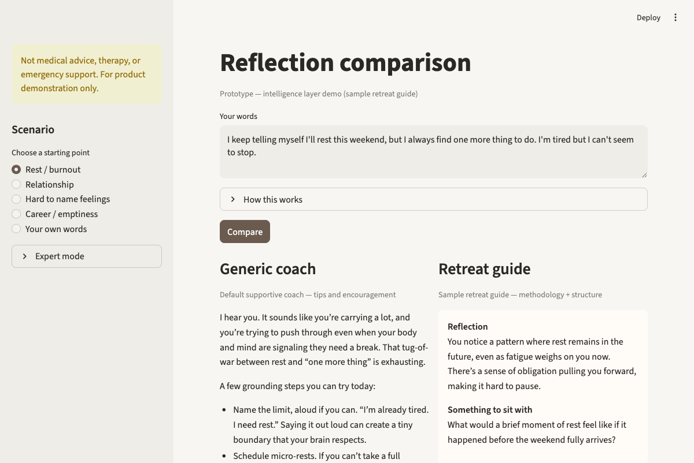

# Actually Understood — An AI that gives you the calm of a retreat guide in your pocket, not another cheerful wellness bot

[Try the app yourself!](https://reflectionagent-mhkmztkehun6shvnojwvdd.streamlit.app/)

---

## What is this?

A live demo for a retreat in your pocket: a calm product that helps people feel deeply understood through reflection—not another generic chatbot.

You enter the same few sentences a user might share after a long week. The app shows two replies side by side:

- A generic supportive coach — warm, practical, full of tips (what most AI wellness products sound like).
- A sample retreat guide — calm, specific, one thoughtful question at most (the direction your facilitators’ methodology points toward).

Same words in. Very different experience out. That gap is what we mean by the intelligence layer—how the product is guided, structured, and exemplified—not “which AI model we bought.”

This is a prototype for conversation, not your final product voice. The guide side is labeled clearly as a sample retreat guide so your team’s real facilitators remain the source of truth in week one.

---

## Screenshot

Rest / burnout — same user input, two columns:

---

## Who is it for?

- Founders deciding what the MVP must prove before heavier investment in memory, tuning, or custom training.
- Facilitators and product leads who need to see whether AI can hold their tone, pacing, and boundaries—not just answer quickly.
- Anyone who has tried “helpful” AI and felt it was cheerful, vague, or full of advice when they wanted to be heard.

---

## What problem does it solve?

| Concern | What the demo shows |
|--------|---------------------|
| “Won’t this just sound like every other AI coach?” | Generic column vs. guide column on the identical input. |
| “How do we know it’s not a black box?” | You can open what guided each reply and edit that guidance, then compare again. |
| “Can we change the voice without rebuilding the app?” | The architecture stays; your facilitators’ words replace the sample guide when you’re ready. |
| “What should MVP focus on first?” | Reflection quality and trust before long memory, RAG, or custom training cycles. |

---

## How does the demo work?

1. Pick a moment — Rest / burnout, relationship, hard-to-name feelings, career emptiness, or your own words.
2. Click Compare — Both sides read the same text you typed.
3. Feel the contrast — Left: encouragement and steps. Right: a short reflection that echoes something you said, plus at most one deepening question.
4. Build trust (optional) — Open Expert mode to see and lightly edit the guidance behind the retreat guide, then Compare again and watch only that side shift.
5. See what actually ran — Under each column, View prompt used shows the exact guidance from that run (so later edits don’t confuse what you’re looking at).

Takes about three minutes to walk through once; scenarios are prefilled so you can focus on the feeling of the replies, not on typing.

---

## Why this matters for your MVP

Your build’s central question is whether AI can produce reflections that make someone say, *“That actually understood me.”* This demo is a fast, honest answer:

- Quality before scale — Prove the experience is specific and calm before adding multi-day journeys or heavy memory.
- Facilitators stay in charge — Methodology, pacing, and safety rules shape every reply; the sample guide is a stand-in until your team’s voice is wired in.
- Clear Phase 1 story — Same underlying capability, different guidance → different trust. That’s the lever you control in the near term.

---

## Three-minute walkthrough (for a live call)

1. *“I’m going to use the same words twice. Only the way the product is guided changes.”*
2. Choose Rest / burnout → Compare.
3. Read one line from the generic side that sounds like a wellness app.
4. Read the guide Reflection — point to a phrase that mirrors what the user said. Read Something to sit with if there’s a question.
5. *“In week one, your facilitators replace this sample guide. The experience architecture you’re seeing stays.”*
6. Optional: Hard to name feelings → Compare again.
7. Close: *“We’re proving voice and methodology first—then we decide what still needs memory or deeper customization.”*

---

## What’s next (after this demo)

- Interview facilitators and swap the sample guide for your tone, pacing, and boundaries.
- Agree on a short quality checklist (specific, calm, emotionally on-target) and iterate together.
- Add lightweight continuity across days when you’re ready—only what your team defines as worth remembering.
- Explore advanced options (deeper memory, retrieval, tuning) only where the checklist still shows a gap.

---

## Related work

This demo sits alongside other agent prototypes built for non-technical stakeholders—lead qualification, brand-voice content, campaign alerts—with the same goal: make expert judgment visible and testable before production.

---

If you’re exploring how to turn facilitator expertise into an emotionally accurate MVP—not generic assistant chat—this demo is the starting conversation.
